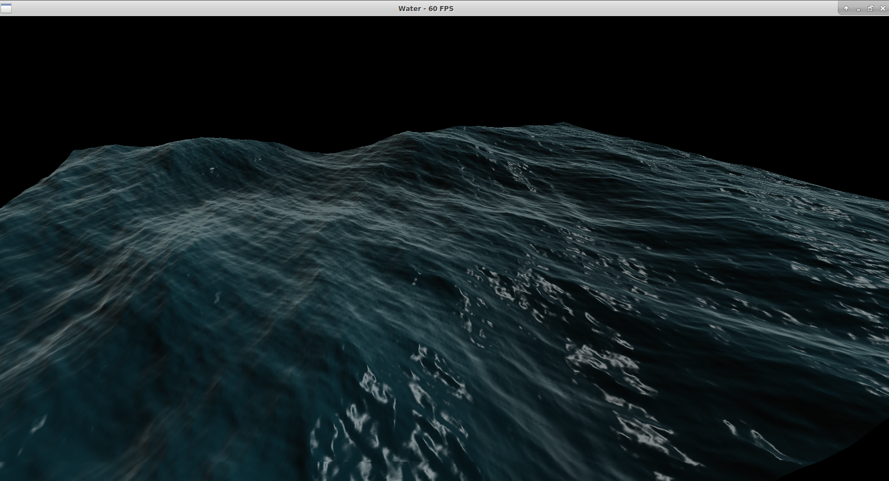
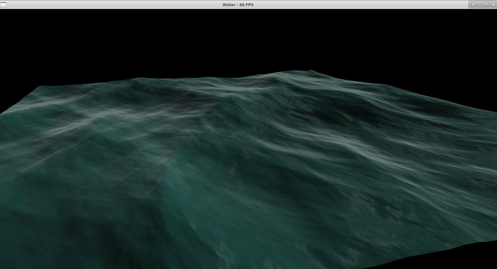

Ocean waves simulation
=========

It's an implementation of classic ocean waves simulation.
It uses a Fast Fourier Transform approach based on famous Tessendorf's work.


### Features
- Phillips spectrum, JONSWAP spectrum (Pierson-Moscowitz, Hasselmann).
- CPU and GPU implementations, OpenGL with GLSL shaders is used as a rendering engine.
- FFT GPU implementation (Stockham).
- This demo has 2 settings presets in yaml-files. Any setting can be changed in runtime, demo will reload settings if they are changed on disk.
- Cubemap env mapping can be turned on.
- One can use A, S, D, W keys for rotation and arrows for movement.


### Screenshots





### Install

Tested on fresh installation of Xubuntu 18.04.3 + updates. No Windows support, sorry.

```sh
sudo apt install make gcc perl
```

cmake:
```sh
sudo apt install cmake g++
```

opengl:
```sh
sudo apt install libgl1-mesa-dev libglu1-mesa-dev libxinerama-dev libxcursor-dev libxrandr-dev
```

gtest:
```sh
sudo apt install libgtest-dev
cd /usr/src/gtest
sudo cmake CMakeLists.txt
sudo make && sudo make install
```

other libraries:
```sh
sudo apt install libyaml-cpp-dev libfreeimage-dev
```

app itself:
```sh
mkdir build && cd build
cmake ..
make
cp water-app .. && cd ..
./water-app preset1.yaml (or any preset)
```

### Acknowledgments

- @dli for the WebGL FFT rendering http://david.li/waves/
- @SergiusTheBest for excellent logging library plog
- @ikalnytskyi for termcolor library
- @sakra for cotire precompiled headers module for CMake
